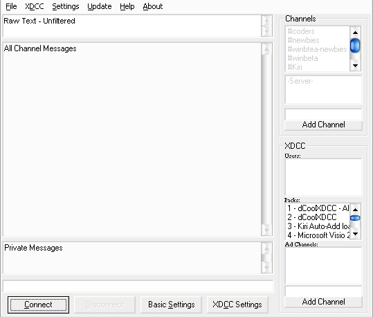



## dCoolXDCC v2\.0 \- IRC XDCC File Bot Program

### Description

/// Discontinued ///

This program/code is discontinued and has been renamed to SentertainmentXDCC.

http://www.sentertainment.net/

/// Old Info ///

First of all...I can't beleive I actually uploaded source code for this...I spent so much time getting this perfect! Well, it's just an XDCC bot for IRC Channels and Servers with advanced messaging abilities. It supports the basic IRC file resume features, along with Private message features...It can even update itself, all in one standalone file! I can't show it all in one screenshot, it's just too much to fit...please forgive me since I didn't show a complete screenshot. (I use themes on my PC) I hope you IRC users at least check this out! I have special compiled versions with the depoendencies included for download at www.dCool101d.tk for those without compilers!

P.S. I'd like to know if this works on older versions of VB
 
### More Info
 

             |
---                |---
**Submitted On**   |2003-09-24 09:42:40
**By**             |[Shawn K](https://github.com/Planet-Source-Code/PSCIndex/blob/master/ByAuthor/shawn-k.md)
**Level**          |Advanced
**User Rating**    |5.0 (25 globes from 5 users)
**Compatibility**  |VB 6\.0
**Category**       |[Complete Applications](https://github.com/Planet-Source-Code/PSCIndex/blob/master/ByCategory/complete-applications__1-27.md)
**World**          |[Visual Basic](https://github.com/Planet-Source-Code/PSCIndex/blob/master/ByWorld/visual-basic.md)
**Archive File**   |[dCoolXDCC\_1649539242003\.zip](https://github.com/Planet-Source-Code/shawn-k-dcoolxdcc-v2-0-irc-xdcc-file-bot-program__1-47832/archive/master.zip)

